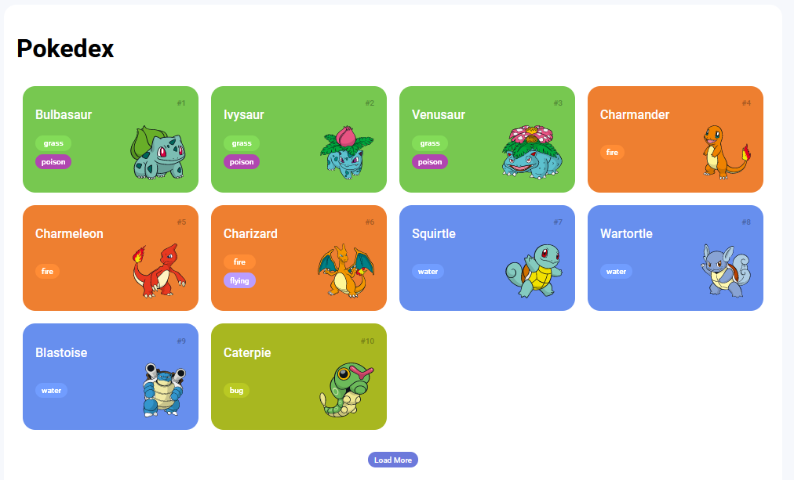

# Trilha JS Developer - Pokedex

-  O projeto consiste em uma aplicação web que exibe informações sobre diferentes pokémons, permitindo aos usuários explorar suas características, tipos, habilidades e mais. Para executar o projeto, será necessário configurar um servidor HTTP local.

  

    

    
    
    
         

  

## Tecnologias Utilizadas
HTML: A estrutura básica da aplicação foi desenvolvida utilizando HTML.

CSS: O estilo visual da aplicação foi implementado com CSS, garantindo um layout agradável e responsivo.

JavaScript: A interatividade da aplicação foi construída com JavaScript. A manipulação do DOM permite atualizar as informações exibidas e melhorar a experiência do usuário.

Fonte de Dados: As informações dos pokémons foram obtidas de uma API pública, que fornece detalhes como nome, número da pokédex, tipos, habilidades e imagens.

HTTP-Server: Para executar o projeto, será necessário um servidor HTTP local. Utilize o http-server para isso.

Instruções de Uso
Clone ou baixe este repositório para a sua máquina local.

Certifique-se de ter o Node.js instalado em sua máquina.

Abra o terminal e navegue até o diretório raiz do projeto.

Instale o http-server globalmente, se ainda não estiver instalado, usando o seguinte comando:

npm install -g http-server
Inicie o servidor HTTP local utilizando o comando:

http-server
Após iniciar o servidor, você receberá uma mensagem informando o endereço local onde a aplicação está sendo executada (geralmente http://localhost:8080). Abra este URL em seu navegador.

Explore a lista de pokémons e clique no botão "Load More" para carregar mais tipos de pokémons na lista.

Créditos
Este projeto foi desenvolvido como parte do Bootcamp Java + Angular Fullstack da DIO. Agradecemos à DIO por fornecer a oportunidade de aprender e aplicar novas habilidades de desenvolvimento web.

Nota: Este projeto é apenas para fins educacionais e não possui nenhuma afiliação oficial com a franquia Pokémon ou suas empresas associadas.